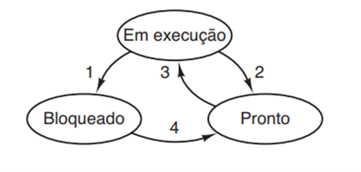
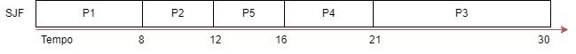

Aluno: Luiz Felipe Vieira

## Atividade 01 de Sistemas Operacionais

### Questão 1:

**Considerando as discussões realizadas em sala, mencione quais são os estados típicos que um processo pode assumir no seu ciclo de vida. Para cada estado, forneça, por exemplo com uma frase, a explicação do que cada estado mencionado significa.**

- Um processo (programa) pode encontrar-se em algum dos três estados abaixo:
  • Em execução (realmente usando a CPU naquele instante).
  • Pronto (executável, temporariamente parado para deixar outro processo ser executado).
  • Bloqueado (incapaz de ser executado até que algum evento externo aconteça).
  

## Questão 2:

**Considerando as discussões realizadas em sala, diga quais são os tipos de sistemas que podem ser identificados, com a finalidade de decidir pela estratégia de escalonamento. Para cada um desses tipos de sistema, mencione e explique brevemente um critério/objetivo que o projetista do sistema operacional deve observar para elaborar a estratégia de escalonamento. Além disso, existem critérios que devem ser observados em qualquer um dos tipos de sistema. Escolha um e explique o seu significado.**

- A estratégia de escalonamento em um sistema operacional depende das necessidades específicas do tipo de sistema em questão, seja ele um sistema de tempo real, interativo ou de lote.
  • Lote.
  • Interativo.
  • Tempo real.

- Em sistemas de tempo real, é crucial que as tarefas sejam atendidas dentro de prazos rigorosos e previsíveis. Portanto, a estratégia de escalonamento deve garantir que as tarefas de alta prioridade sejam tratadas antes e dentro de seus prazos definidos.
- Em sistema interativo o escalonamento deve ser projetado para dar prioridade a processos que interagem diretamente com os usuários, de modo que as respostas às ações do usuário sejam rápidas e eficientes.
- Sistemas em lote ainda são amplamente usados no mundo de negócios para folhas de pagamento, estoques, contas a receber, contas a pagar, cálculos de juros (em bancos), processamento de pedidos de indenização (em companhias de seguro) e outras tarefas periódicas. Em sistemas em lote, não há usuários esperando impacientemente em seus terminais para uma resposta rápida a uma solicitação menor.

---

**Atividades com algoritmos de escalonamento: Considere os cinco processos a seguir, com o tempo de execução estimado, e o tempo de chegada do processo:**

| Processo | Tempo de execução | Momento de chegada |
| -------- | ----------------- | ------------------ |
| P1       | 8                 | 0                  |
| P2       | 4                 | 1                  |
| P3       | 9                 | 2                  |
| P4       | 5                 | 3                  |
| P5       | 4                 | 4                  |

**Nessa situação apresentada, considere a utilização dos seguintes algoritmos de scalonamento (note que não há prioridade estabelecida entre os processos):**

## Questão 3:

**SJF (Shortest Job First - ou menor tarefa primeiro), que não tem preempção.**

_Sem preempção = o processo só é interrompido quando estiver concluído_

| Processo | Tempo de execução | Momento de chegada | Tempo finalizado | chegada - finalização |
| -------- | ----------------- | ------------------ | ---------------- | --------------------- |
| P1       | 8                 | 0                  | 8                | 8                     |
| P2       | 4                 | 1                  | 12               | 11                    |
| P3       | 9                 | 2                  | 30               | 28                    |
| P4       | 5                 | 3                  | 21               | 18                    |
| P5       | 4                 | 4                  | 16               | 12                    |
|          |                   |                    | Média            | 15,4                  |

## Questão 4:

Round Robin, com quantum=1

.jpg>)

| Processo | Tempo de execução | Momento de chegada | Tempo finalizado | chegada - finalização |
| -------- | ----------------- | ------------------ | ---------------- | --------------------- |
| P1       | 8                 | 0                  | 28               | 28                    |
| P2       | 4                 | 1                  | 17               | 16                    |
| P3       | 9                 | 2                  | 30               | 28                    |
| P4       | 5                 | 3                  | 23               | 20                    |
| P5       | 4                 | 4                  | 20               | 16                    |
|          |                   |                    | Média            | 21,6                  |

## Questão 5:

Classe de prioridades (ou fila de prioridades). Neste caso, adicione as seguintes prioridades aos processos: P1=2, P2=1, P3=2, P4=2, P5=1

| Processo | Tempo de execução | Momento de chegada | Prioridade |
| -------- | ----------------- | ------------------ | ---------- |
| P1       | 8                 | 0                  | 2          |
| P2       | 4                 | 1                  | 1          |
| P3       | 9                 | 2                  | 2          |
| P4       | 5                 | 3                  | 2          |
| P5       | 4                 | 4                  | 1          |

